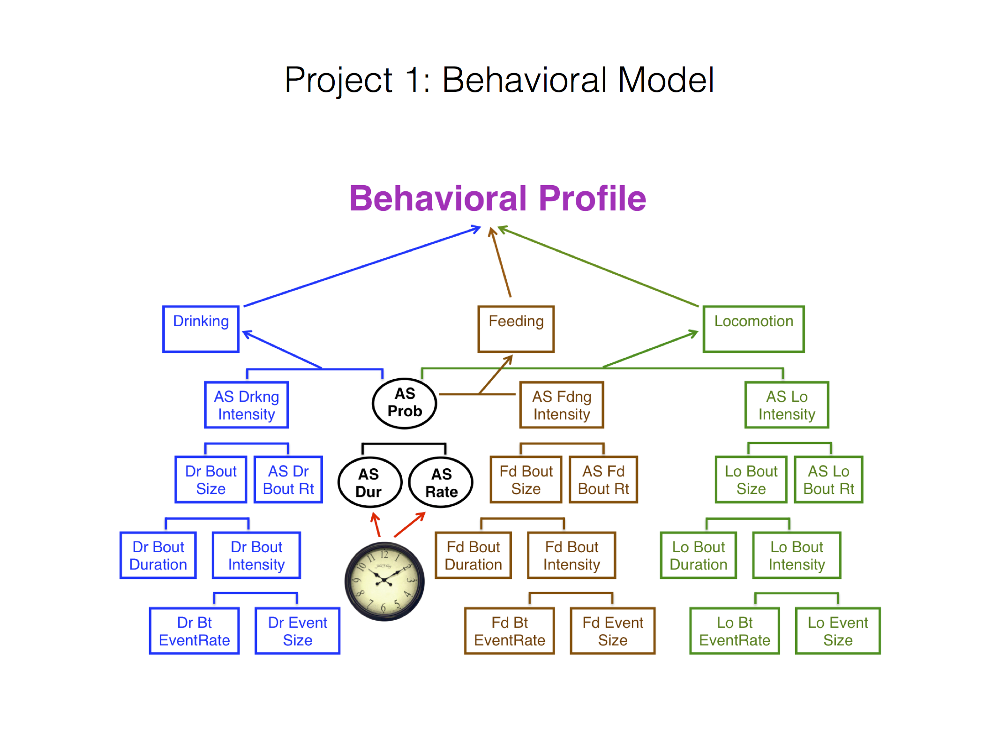

.. _behavior:

Behavioral Model
================

Statement of Problem:
---------------------

In order to differentiate mice, we need to create a detailed behavior
profile to describe:

1. how they drink, feed or move (locomotion) and
2. how they translate between active state or inactive state.

We have the following key background information from the paper:

-  **Home Cage Monitoring System(HCM)** HCM cages were spatially
   discretized into a 12 x 24 array of cells and occupancy times for
   each MD were computed as the proportion of time spent within each of
   the 288 cells. To determine whether animals establish a Home base,
   HCM cages were spatially discretized into a 2 x 4 array of cells, and
   occupancy times for each mouse day were calculated as above. In the
   experiment, 56/158 animals displayed largest occupancy times in the
   cell containing the niche area, which was considered to be their Home
   base location.

-  **Active and Inactive State** Mice react differently during
   Active state and Inactive states and
   all behavioral record should be classified into 2 mutually exclusive
   categories, Active States (ASs) and Inactive States (ISs). To
   designate ISs, we examined all time intervals occurring between
   movement, feeding, and drinking events while the animal was outside
   the Home base. Those time intervals exceeding an IS Threshold (IST)
   duration value were classified as ISs; the set of ASs was then
   defined as the complement of these ISs. Equivalent mathematically,
   ASs can also be defined as those intervals resulting from connecting
   gaps between events outside the Home base of length at most IST; ISs
   are then defined as the complement of these ASs. (*Active State
   Organization of Spontaneous Behavior Patterns*, C. Hillar et al.)

Statement of statistical problems:
----------------------------------

The above flowchart shows the key metrics that are required by the study
to capture the behavioral profile:

   Behavioral Profile (image courtesy of Tecott Lab)

The main focus is 3 key states of the mice i.e. [*Drinking \| Feeding \|
Locomotion*\ ]

Each of these metrics can be seen visually in the slides referenced
below. Each metric is a tree, decomposed into two child node metrics,
whereby when the child nodes are multiplied together, they yield the
parent metric.

-  AS [*Drinking \| Feeding \| Locomotion*\ ] Intensity
-  *A note about intensity:* We are not entirely sure what the Tecott
   Lab's meaning of "intensity" is. Our current hypothesis is that
   intensity is defined as quantity over active state time. E.g. for
   drinking, intensity is the quantity consumed divided by the total
   amount of time the mouse is in an active state.

   -  [*Drinking \| Feeding \| Locomotion*\ ] Bout Size

      -  [*Drinking \| Feeding \| Locomotion*\ ] Bout Duration
      -  [*Drinking \| Feeding \| Locomotion*\ ] Bout Intensity

         -  [*Drinking \| Feeding \| Locomotion*\ ] Bout EventRate
         -  [*Drinking \| Feeding \| Locomotion*\ ] Event Size

   -  [*Drinking \| Feeding \| Locomotion*\ ] Bout Rt

Additionally the following needs to be calculated for Inactive /Active
State:

- AS Probability: the probability of AS among all time period
- AS Duration: the length of time of AS
- AS Rate: the reciprocal of average length of time of AS

Data Collection:
----------------

The data we have:

- the observations of location for each mice, $(x, y, t)$ with $t$ small.
- the aggregated time binned features about each event and its intensity.

The data we need:

- the observation of consumption size and moving distance with each event.

Exploratory Analysis
--------------------

Based on the data requirements being provided, we will need to start
plotting the following metrics:

For Event

- Event Consumption or Distance: Already in basic time bin features.
- AS Event Intensity: Already in basic time bin features.
- AS Bout Routine: Use `txy_coords` within each event intervals to generate
  the path.
- Event Bout Size or Distance: Use observation of consumption size and
  moving distance data.
- Event Bout Duration: Use event intervals data.
- Event Bout Intensity: Use Event Consumption or Distance over minute of AS time
- Event Size: Use interval to get the number of event happened in binned time
- Event Bout Rate: Use Event Size over AS time.

For In/Active State

- AS Probability: Already in basic time bin features.
- AS Duration: Already in basic time bin features.
- AS Rate: Use AS Number over AS Duration.

Data Requirements Description
-----------------------------

The data we have:

- a dataframe of observations of location for each mice, $(x, y, t)$
  with $t$ small.
- The above dataframe with a classification of strain number and mouse
  number at each time $t$ (if available)

The data we require:

- The above dataframe with AS/ IS properly classified at each point $t$ for
  each mouse
- The above dataframe with a classification of drinking, feeding and
  locomotion for each mouse at each time $t$
- The above dataframe with a classification of consumption size and moving
  distance with each event at each time $t$

A graphic view of the above is as below:

======  =====  ======  =====  ========  =======
strain  mouse   time   IS/AS  D/F/L/S*  Consn.
======  =====  ======  =====  ========  =======
0       1      1.1     IS     S         0
0       1      1.4     AS     F         4
1       2      1.1     AS     D         5
1       2      1.3     AS     D         3
1       2      1.6     IS     S         0
======  =====  ======  =====  ========  =======

\*\ **``D/F/L/S``** above is a flag for **D**\ rinking/ **F**\ eeding/
**L**\ ocomotion/ **S**\ tationary

Methodology/ Approach Description
---------------------------------

We wish to create a single function that should be able to return all of
the above metrics as a list:

Key inputs are:

- mouse/ strain as string
- starting time
- ending time
- a dictionary containing the rectangular vertices marking the area to
  restrict the movement to i.e. x\_lower, x\_upper, y\_lower, y\_upper.
- [*Drinking \| Feeding \| Locomotion*\ ] state specification
- The main output is a list containing the key metrics stated in
  ``Statement of statistical problems`` section

- Key idea is that if we have the most granular dataframe in
  ``Data Requirements Description`` then the Python code is really just
  a SQL (in ``pandas`` form) filtering/ grouping query to generate the
  required output metrics (from flowchart) in the form of a list

An example of a metric calculation for `Drinking` is as follows:
$\frac{Drinking}{Total\ Time}=\frac{Drink\ Consumed}{AS\ Time}\times \frac{AS\ Time}{Total\ Time}$

Testing Framework Outline
-------------------------

Additional Remarks
------------------

- It is not clear exactly how the specified required metrics are to be
  calculated in the form of a single query or multiple queries. We need
  more clarification on what intensity means.
- Not sure yet whether the required dataframe at the most granular
  level can be easily constructed. This would be really useful for all
  projects to use so we should really consider developing it for the
  wider team.
- Some of the required data metrics like consumption of food/ water at
  each time t may not be easy to obtain as they are provided for each
  interval. These may have to be prorated across each time t in some
  stable way in the construction of the required dataframe
- We also believe that the metrics provided at each point are single
  point statistics i.e. means. We should consider outputing the actual
  histogram of values at each point for the given metric rather than
  just the single-valued mean metrics

   - For example, we may not only be interested in the average amount
     of active time spent in locomotion, but the distribution of
     locomotion. This is a more complicated metric than those outlined
     in the work by the Tecott Lab's papers referenced below. With this
     information, we could potentially see interesting trends: the
     proportion of a mouse-day spent in locomotion could be the same in
     two time chunks, but the types of movements (distances) could form
     a more nuanced distribution.

- Not sure if this is feasible, but if we had to produce the mean value
  we could output the time series mean value over the given interval
  rather than *just* the overall mean from the given interval
