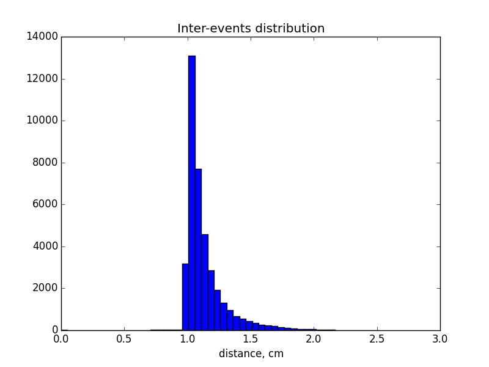
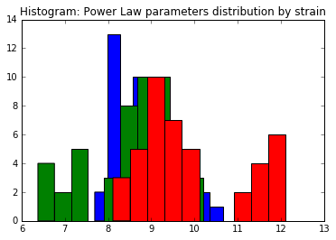
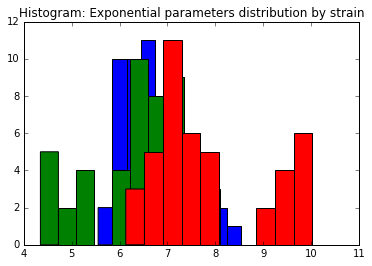
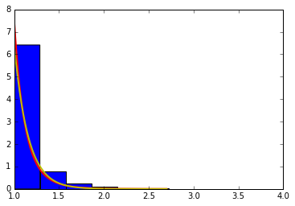

.. _distribution:

Power Laws & Universality
=========================

Statement of Problem:
---------------------

To take a closer look at the tail property of locomotion, we analyze the
moving distance distribution for home based mice and non home based
mice.

Statement of Statistical Problem:
---------------------------------

The major statistical question is how to choose fitted distribution
family. Based on conventions and data we have, we propose two
distributions: law decay distribution and gamma distribution: - In
statistics, power law, also known as a scaling law, is a functional
relationship between two quantities, where a relative change in one
quantity results in a proportional relative change in the other
quantity, independent of the initial size of those quantities: one
quantity varies as a power of another. $F(x)=kx^{-a}$. This power
law decay only works for monotone decreasing distribution. - If the
distribution is not monotone decreasing, power function may not be
realistic. In this case, the distribution is left skewed with one peak
(see exploratory analysis). Thus we can make more general assumption,
gamma distribution.

Exploratory Analysis
--------------------

-  The difference between “home base” and “non home base”: "home base",
   which means a favored location at which long periods of inactivity
   (ISs) occur, is a post defined characteristic of the mouse.
-  The definition of inter-event distance: literally, inter-event
   distance is the distance within one single event. Investigating the
   data of the distance between each two consecutive points recorded by
   the detector of one mouse day, we found the shape of the histogram is
   similar to the plot on the slide, except the value of frequency is
   bigger. This inconsistency gives us the motivation to calculate the
   inter event distance instead of the distance between each two points.
   For this purpose, we need a vector of the index of events for each
   mouse day. In particular, the mapping vector is connected by time
   since xy coordinates are recorded according to time and the event is
   defined based on time.

   Distribution

- Preferred choice of distribution: the power law is a
  monotone decreasing, however our plot indicates a peak, in which gamma
  distribution may fit better.

Data Requirements Description
-----------------------------

-  Label of “home base” or “non home base”: generated in the process of
   data pre-processing by the definition
-  Event index corresponding to the time: a vector mapped the time
   indicating the events.
-  Inter event distance: calculated by the square root of the sum of the
   difference x,y coordinates

Methodology/ Approach Description
---------------------------------

Given the estimated parameter for each distribution, we can learn more
about its distribution and the information lies mainly in the decay rate
of the tail.

Here are our algorithms:

- Draw the histogram for our data.  Observe the distribution and intuitively
  figure out whether our distribution assumption makes sense.
- Estimate parameters based on MoM or MLE.
- Add the density function to our histogram, see the fitness of
  our distribution.
- Conduct statistical test to quantitatively analysis the fitness (Pearson chi
  square test). For testing the hypothetical distributions of a given array,
  there are several existing commonly used methods. However, each approach has
  their pros and cons. Following is a short overview of these testing framework.
  We recommend that all the methods are to be tried to get a comprehensive
  understanding of the inter-event step distributions.
- Pearson Chi-square test
- Fisher’s exact test
- KS test

Testing Framework Outline
-------------------------

The potential functions are recommended to implement:

-  Retrieve data function (*retrieve\_data*): Given the number of mouse
   and the date, create a data frame containing follow variables. 1)
   position: x,y coordinates 2) time: detecting time stamp for each pair
   of coordinates, time interval label for events, time interval label
   for active state and inactive state.

-  Retrieve event function (*retrieve\_event*): Given an event label
   (e.g. Food), subset respective part of data from the data frame we
   got in *retrieve\_data*

-  Compute the distance (*compute\_distance*): Given event label,
   compute the distance between each time stamp. As we already know the
   x, y coordinates from the dataframe in *retrieve\_event*, the
   simplest way to implement this function is that:

   .. math:: distance = ((x_t2 - x_t1)^2+(y_t2 - y_t1)^2)^(1/2)

-  Draw histogram (*draw\_histogram*): Given a sub-array, using the plt
   built-in histogram function to draw the plot. Test distribution
   (*fit\_distr*): Given the testing methods (e.g. “ks”), implement the
   corresponding fitting methods. The potential output could be p-value
   of the hypothesis test.

Based on the potential functions to be implemented, the following is the
guide of testing:

-  *test\_retrieve\_data*: attain a small subset of data from x,y
   coordinate and t, and feed in the function. Compare the results with
   the counted number.

-  *test\_retrieve\_event*: Use the small data frame we get in
   test\_retrieve\_data, given different events/state. Compare the
   results with our counted number.

-  *test\_compute\_distance*: Given x = 3, y =4, the output should be 5.

-  *test\_fit\_distr*: randomly draw samples from widely used
   distributions (e.g. uniform). Test it with right(e.g. uniform) and
   wrong(e.g. gamma) distributions. Compare the p-values with given
   threshold (e.g. alpha = 95%)

Result
--------------------

-  The histogram of estimators from powerlaw:

-  The histogram of estimators from exponential:

-  The histogram of data and fitted curve for strain 0, mouse 2, day 5:

-  Fitting power law distribution and gamma distribution for strain 0, mouse 0,
   and day 0; fitting by Maximum Likelihood, and by minimizing Kolmogorov
   CDF distances:

.. plot:: report/plots/hist_kolmogorov.py

   Histogram of distances travelled in 20ms by strain 0, mouse 0, day 0.

Reference reading:
------------------

-  https://en.wikipedia.org/wiki/Power\_law

